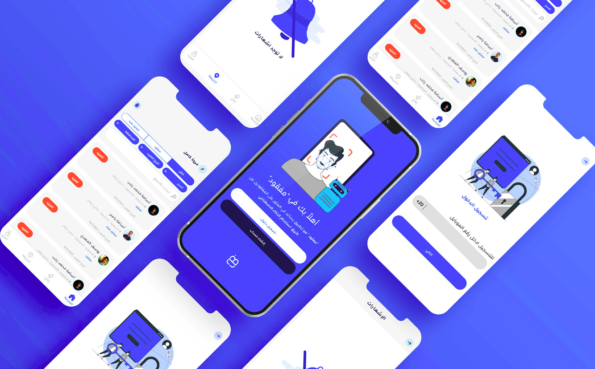

### :telescope: About MafQud: 

`MafQud is a mobile application that leverages cutting edge Computer Vision techniques to help find missing people.`

 

**`Watch our Youtube video:`**    

People who are willing to help will submit pictures of children whom they suspect to be lost or kidnapped, along with the location in which they found him/her.
On the other hand, families of victims need to upload pictures of their missing child along with some distinctive information about him/her.
From here, a matchmaking process starts that identifies faces using a Facial Recognition Model.
After a successful matchmaking process, a notification will be sent to the victim's family informing them that their missing child has been found,
and they will be sent the contact info of the person who found him along with the location he found the child in.

### :vibration_mode: MafQud Objective(S): 
In the early stages of the project, we all have the same goals and objectives that we
want to achieve by the end of the project and become clear to us throughout the phases
of the project that we are walking towards achieving these goals. The objectives are not
only technical but also non-technical. That includes:     
- **Value**:
In MafQud, we see how we can understand the problem we intend to solve, put
ourselves in our user’s shoes, value his pain and try hard to help him That is how we
can add value for our users and for society.
- **Impact**:
Adding value for our users means there is a chance for impact, a positive one, that can
last for a long time or even forever! That's what we aspire to do.
- **Learn**:
Having a project like MafQud with its details is a new challenge for our society to have,
and also for us to implement, an open chance to learn new things and explore new
areas, reach our limits, and beyond. With MafQud there were and still are new things to
learn and explore.
- **Collaborate**:
In MafQud, it is important to work as a team, from the smaller sub-teams that come
together to make MafQud. We believe that teamwork and collaboration are great values
to have.
- **Communicate**:
We are eager to communicate effectively with each other, to build a clear way of
communication that has less risk of misunderstanding or unclarity. In MafQud, we seek
to respect each other and value the other’s work and not underestimate it.
- **Share**:
We believe that sharing is what builds our community, and takes it to a new era of
advancement. That’s why we are aware and interested in sharing the knowledge
between us to become united and to build a way of sharing this knowledge with the
open-source world.

### :railway_track:	 MafQud Team:

 

-   Youssef El-Mahdy `Project manager`
-   Marwa Kamel `UI/UX designer`
-   Ahmed Shehata `Android developer`
-   Osama Yasser `Back-end developer`
-   Osama Ragab `Back-end developer`
-   Eman Ebrahim `Data scientist`
-   Tasneem Nabil `Data scientist`
-   Omar Hegazy `Data scientist`

### :railway_track:	 MafQud branding:
[MafQud Branding](https://www.behance.net/gallery/142190383/MafQud-Branding)

### :star2:	 List Of Features:

 
  
  
-   Splash screen
-   Onboarding
-   Sign-up and login
-   Report a missing/ found case
-   Image previewer
-   Push notifications
-   Native maps
-   Device hardware access (camera, GPS)

      

### :boom: MafQud on Google Play:

 
 

-   [MafQud](https://play.google.com/store/apps/details?id=com.mafqud.android)
-   Released on: Jul 2, 2022
-   Programming language: Kotlin.  
-   OS versions: Android 5 and above
-   Contact Email: mafqudapp@gmail.com
-   [Privacy Policy](https://gist.github.com/Eng-AhmedShehata/aae20217432b3679e1fce357cbc46f5d)

 

### :open_book: Dependencies:
Dependencies are any aspect that the product or product team relies on to meet objectives. These may include:

-   Third-party software that app relies on   
[compose](https://developer.android.com/jetpack/compose/setup)    
[Lifecycle](https://developer.android.com/jetpack/androidx/releases/lifecycle)    
[Pager layouts](https://google.github.io/accompanist/pager/)    
[DataStore](https://developer.android.com/jetpack/androidx/releases/datastore)    
[kotlinx.coroutines](https://github.com/Kotlin/kotlinx.coroutines)    
[Dagger Hilt](https://developer.android.com/training/dependency-injection/hilt-android)     
[Retrofit](https://square.github.io/retrofit/)    
[CameraX](https://developer.android.com/jetpack/androidx/releases/camera)    
lottie    
Maps compose  
Firebase crashlyatics   
Firebase phone verfication   

### :railway_track:	 What's next?:
- Test the app (Unit, Integration, UI)
- Fix bugs
- Add new feaures

### Licence:
[MIT License](https://choosealicense.com/licenses/mit/)
